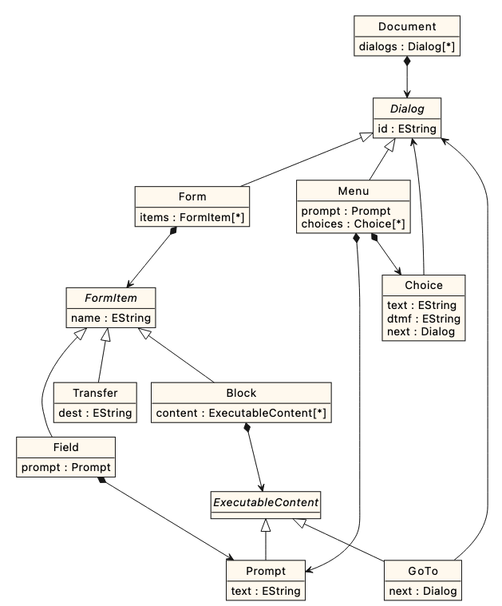

# Mini VoiceXML

Toy version of [W3C VoiceXML specification](https://www.w3.org/TR/voicexml20/) implemented with EMF/Ecore. The repository contains the [Mini VoiceXML metamodel](minivoicexml) and a [command-line interpreter](minivoicexml.interpeter) for Mini VoiceXML models.

## Metamodel

